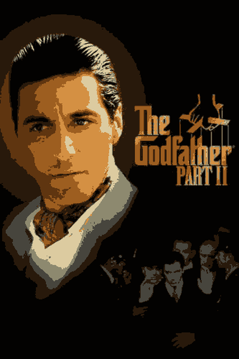

# Color Bars
Color Bars takes the movie posters of [IMDb's top movies](http://www.imdb.com/chart/top) and performs k-means clustering to produce a color quantized version of each poster. Then, these color quantized posters are used to produce a color bar representing the proportion of each color in the poster.

<section>
    
    
    
    
    
    
</section>

# Usage:
	$python color_clustering.py --help
	usage: color_clustering.py [-h] -i IMG -k CLUSTERS
	
	optional arguments:
		-h, --help			show this help message and exit
		-i IMG, --img IMG	Image path
		-k CLUSETERS, --clusters CLUSTERS
							Number of clusters
	
	$python imdb_posters.py --help
	usage: imdb_posters.py [-h] -k CLUSTERS
	
	optional arguments:
		-h, --help			show this help message and exit
		-k CLUSTERS, --clusters CLUSTERS
							Number of clusters
							
# Examples (k = 8): 10/13/15 IMDb Top 10

<section>
    
    
    
</section>

<section>
    
    
    
</section>

<section>
    
    
    
</section>

<section>
    
    
    
</section>

<section>
    
    
    
</section>

<section>
    
    
    
</section>

<section>
    
    
    
</section>

<section>
    
    
    
</section>

<section>
    
    
    
</section>

<section>
    
    
    
</section>

# More Examples (k = 8)

<section>
    
    
    
</section>

<section>
    
    
    
</section>

<section>
    
    
    
</section>

<section>
    
    
    
</section>

<section>
    
    
    
</section>

<section>
    
    
    
</section>

<section>
    
    
    
</section>

<section>
    
    
    
</section>

<section>
    
    
    
</section>

<section>
    
    
    
</section>

To view all 250 color bars, see [color_bars_4](color_bars_4) for k = 4 and [color_bars_8](color_bars_8) for k = 8.
